# MusicPlayer2 帮助
> Note: This page is currently only available in Chinese.
>
> 注：此页面尚未完善。

文本档篇幅较长，可以通过查找功能来找到你需要的内容。

**目录**

[TOC]

## 简介

MusicPlayer2是一款功能完善的本地音乐播放，旨在为Windows用户提供最佳的本地音乐播放体验。

## 功能介绍

### 主界面

播放器目前提供两套界面布局，点击主界面工具栏中的“切换界面”按钮可以在两种界面布局中切换，如下图所示。

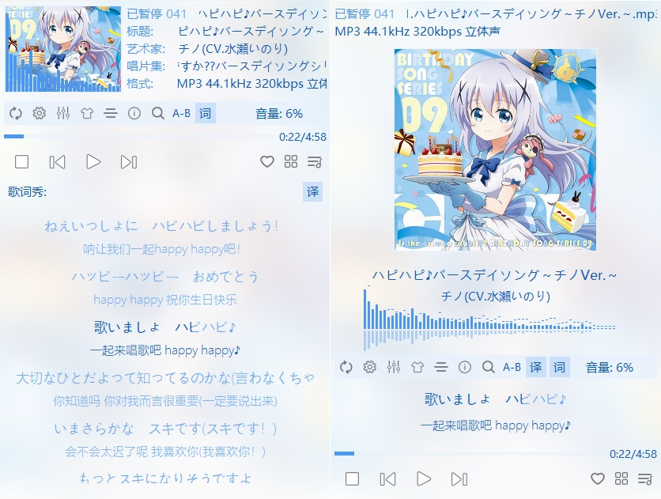

当窗口的宽度小于一定的值时，播放列表会放到窗口的下方，如图所示：

#### 界面工具栏和按钮

##### 工具栏

*  循环模式按钮

  点击此按钮会在“顺序播放”、“随机播放”、“列表循环”和“单曲循环”四种模式中循环切换。

  在此按钮在点击鼠标右键会弹出右键菜单。

  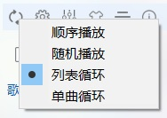

* 设置按钮
  
  点击此按钮会弹出选项设置。
  
* 音效设定按钮
  
  点击此按钮会弹出音效设定窗口，可以设置均衡器和混响。
  
*  切换界面按钮
  
  点击此按钮可以在两种界面而已中切换。
  
* 迷你模式按钮

  点击此按钮将进入迷你模式。

  

* 曲目信息按钮

  点击此按钮会弹出属性对话框，并显示当前播放曲目的信息。

* 查找歌曲按钮

  点击此按钮查找歌曲。

* AB 重复按钮

  点击此按钮使用 AB 重复功能。

  在正常模式下点击 AB 重复按钮将选定重复的 A 点，再次点击将选中 B 点并进入 AB 重复状态，再次点击退出 AB 重复状态。

  在此按钮在点击鼠标右键会弹出右键菜单。

  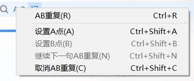

  AB 重复功能详细介绍参见<a href="# AB 重复功能">“AB 重复功能”</a>章节。

* 显示歌词翻译按钮

  点击此按钮将显示或隐藏歌词翻译。此按钮将影响所有界面的歌词显示。

  只有当歌词有翻译时此按钮才有效。

  > 注：在带翻译的歌词的每一行歌词中，歌词原文和翻译通过“` / `”（空格+左斜杠+空格）来分隔，只有这种格式才被认识是有翻译的歌词，如下图所示。
  > 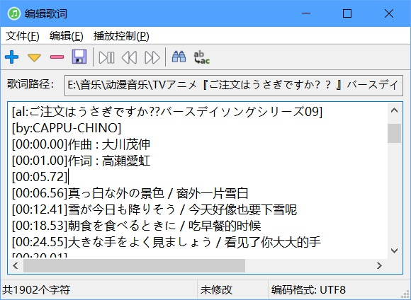

* 显示桌面歌词按钮

  点击此按钮将显示或隐藏桌面歌词。

  

  桌面歌词功能详见<a href="# 桌面歌词">“桌面歌词”</a>章节。

##### 其他按钮

* “我喜欢”按钮

  点击此按钮会将正在播放的歌曲添加到“我喜欢的音乐”播放列表中，再点击一次则会从“我喜欢的音乐”播放列表中移除。

* 媒体库按钮
  
  点击此按钮打开媒体库。
  
* 播放列表按钮
  
  点击此按钮显示或隐藏播放列表。
  
  右击此按钮会弹出右键菜单。
  
  在右键菜单中选择“停靠的播放列表”，则点击此按钮的功能是显示或隐藏停靠的播放列表。如果选择“浮动的播放列表”，则点击此按钮的功能是显示或隐藏浮动的播放列表。
  
  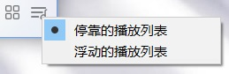
  
* 主菜单按钮

  此按钮位于主窗口的右上角，只有当隐藏了菜单栏的时候都会显示。点击后弹出主菜单。

* 全屏显示按钮

  此按钮位置主窗口的右上角，当不显示停靠的播放列表时显示。点击后进入全屏模式。

  全屏模式详细说明参见“主界面”——“全屏模式”章节。

#### 主题颜色

在菜单栏中的“工具”——“选项”——“外观设置”——“主题颜色”中可以设置主题颜色，默认情况下，播放器将跟随系统主题颜色，此功能支持 Windows Vista 及以上的所有 Windows 系统。

你也可以自定义主题颜色。

主题颜色将影响主界面、迷你模式、搜索框显示播放信息、播放列表、所有列表控件和其他自定义控件等。

#### 全屏模式

选择菜单栏中的“视图”——“全屏模式”命令，或点击主窗口右上角的“全屏模式”按钮，或者按下键盘上的F11，将进入全屏模式。如下图所示：

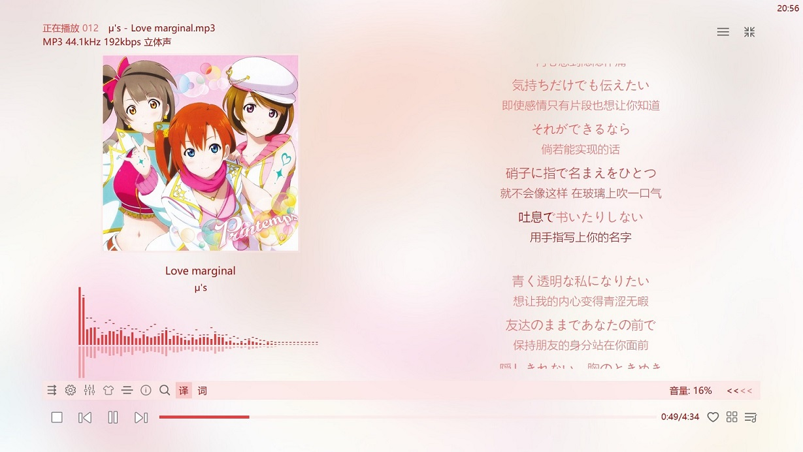

全屏模式下，所有界面元素都将放大为原来的1.5倍。

全屏模式下，迷你模式命令不可用。

你可以通过点击右上角的“全屏模式”按钮或按下F11来退出全屏模式。

### 文件夹模式和播放列表模式

播放器主界面中将以两种方式组织音乐，文件夹模式和播放列表模式。

在文件夹模式下，下图红框中显示“文件夹”，右侧文本框显示当前播放的文件夹路径。而播放列表模式下则显示“播放列表”，右侧文本框显示播放列表名称。

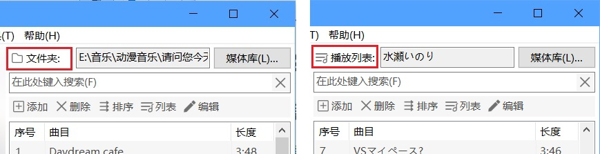

#### 文件夹模式

文件夹模式下，每次打开一个文件夹进行播放，播放器会自动搜索文件夹内的音频文件并加载到播放列表，此时你无法对列表中的项目执行添加、删除、上移、下移等操作，也无法对播放列表中的曲目拖动排序。

#### 播放列表模式

在播放列表模式下，你可以建立播放列表，并在播放列表中自由添加音频文件。此模式下，你可以对列表中的项目自由编辑，添加、删除、上移、下移等命令也处理可用状态。你还可以通过鼠标拖动对播放列表中的项目排序。

### 媒体库

点击主界面中“媒体库”按钮，或播放列表上方的“媒体库”按钮可以进入媒体库界面。

媒体库界面包含如下几个标签。

点击媒体库对话框左下角的“媒体库设置”按钮将打开选项设置对话框，并总是切换到“媒体库”标签。关于媒体库设置详细说明参见“选项设置”——“媒体库”章节。

#### 文件夹

在文件夹标签中，你可以看到文件夹模式中播放过的文件夹。每次播放一个文件夹后，该文件夹会被放到列表的最前面。

打开一个文件夹将进入文件夹模式。

#### 播放列表

播放列表标签中显示了所有的播放列表。你可以自由创建播放列表。

打开一个播放列表后将进入播放列表模式。

创建新播放列表的步骤如下：

* 点击“新建播放列表”按钮。

  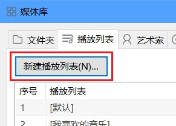

* 输入播放列表名称。

  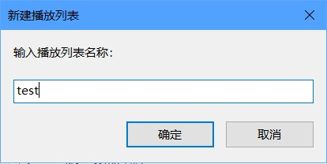

* 选中刚刚新建的播放列表，点击“播放选中按钮”。

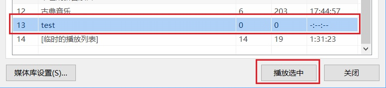

* 点击播放列表上方的“添加”按钮，选择“添加文件”或“添加文件夹”命令向播放列表中添加文件。

  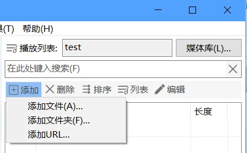

播放列表界面中有几个特殊的播放列表：“默认”、“我喜欢的音乐”和“临时的播放列表”，你无法对这几个播放列表执行重命名和删除操作。

所有播放列表数据储存在“`./playlist`”目录下，每个播放列表对应了一个播放列表文件，文件名即为播放列表的名称，因此播放列表的名称不能包含“`\"/:*?<>|`”等不允许作为文件名的字符。

其中“`./playlist/recent_playlist.dat`”文件保存了每个播放列表中“上次播放曲目”、“曲目数”、“总时长”等信息。

##### “默认”播放列表

从资源管理器中打开的音频文件将添加到“默认”播放列表。

##### “我喜欢的音乐”播放列表

在主界面中点击“我喜欢”按钮会将当前歌曲添加到“我喜欢的音乐”播放列表。

##### 临时的播放列表

在“媒体库”界面中除“文件夹”和“播放列表”外的其他标签中播放的曲目都会添加到临时的播放列表。注意，每次从媒体库中播放曲目时会覆盖“临时的播放列表”，而不是在列表后面追加。

除此之外的为用户自由创建的播放列表。

播放列表界面中显示了每个播放列表的曲目数、上次播放到的曲目序号和总时长。注意，只有当打开了一个播放时，这些信息才会更新。

#### 艺术家、唱片集、流派、年份

这几个标签页分别以不同的方式组织媒体库中的音乐。

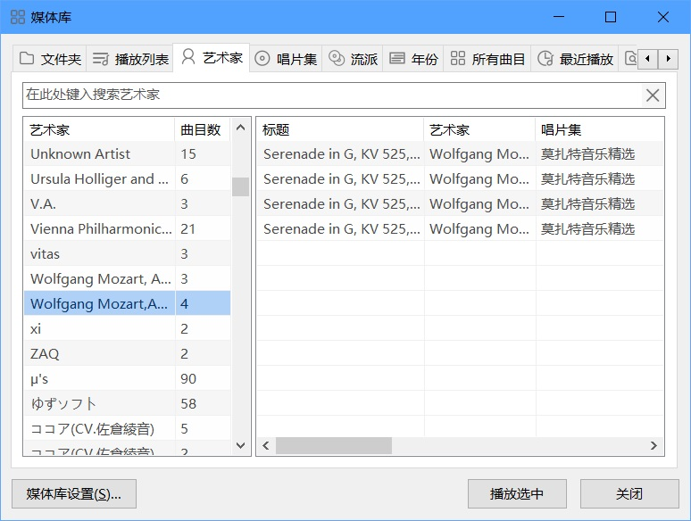

以“艺术家”标签为例，界面中左侧列表显示了所有的艺术家，在左侧列表中选中一个艺术家后，右侧列表中会显示出当前艺术家的曲目。

选中左侧列表后点击“播放选中”，会将选中艺术家的所有曲目覆盖到“临时的播放列表”，并自动播放第一首曲目。选中右侧后，也会将当前艺术家中的所有曲目覆盖到“临时的播放列表”，并自动播放选中的曲目。

#### 所有曲目

此标签页中显示了媒体库中所有曲目。

#### 最近播放

此标签页中显示了所有播放过的曲目，并默认按播放时间从近到远排序。

如果需要清空“最近播放”中的曲目，你可以点击“媒体库设置”，点击“清空最近播放曲目列表”。

#### 文件夹浏览

此标签页显示以树形结构显示了“媒体库设置”中设置的媒体库文件夹。

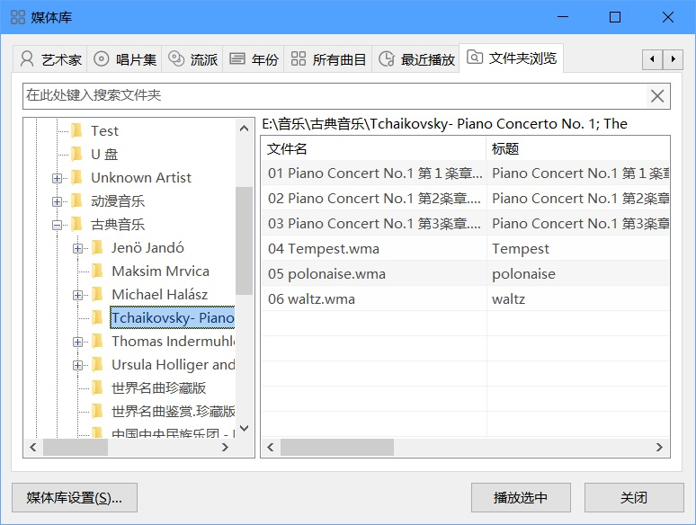

点击左侧树中的任意一个文件夹，右侧列表会显示选中文件夹下的所有曲目（不含子文件夹）。

在左侧树的一个文件夹上点击鼠标右键，选择“播放”，会在文件夹模式下播放选中的文件。选择“添加到播放列表”或“添加到新播放列表并播放”，会将选中文件夹及其子文件夹下的所有曲目添加到指定的播放列表。

### 菜单说明

#### 主菜单

除了可以在主窗口菜单栏使用主菜单外，还可以点击标题栏左侧的应用程序图标或右击标题栏打开主菜单，也可以在按住Shift键的同时在主窗口（或迷你模式窗口）任意位置点击鼠标右键打开主菜单。如下图所示：
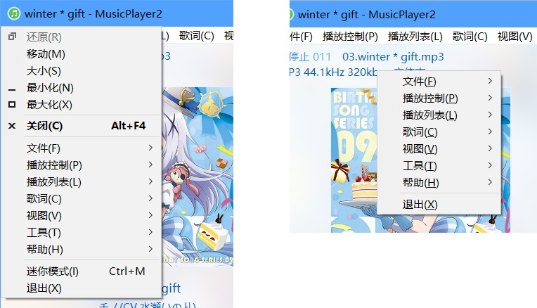

##### 文件

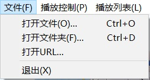

- 打开文件

  弹出打开文件对话框，打开一个或多个文件，添加到`默认`播放列表。

- 打开文件夹

  弹出打开文件夹对话框，打开一个文件夹，将进入文件夹模式。不支持添加子文件夹。

  如果要在播放列表中添加一个文件夹，在播放列表上方点击“添加”按钮，选择“添加文件夹”命令，可以将文件夹中的所有文件添加到当前播放列表，

- 打开URL

  输入一个URL并添加到`默认`播放列表中播放。

- 退出

  退出程序。

##### 播放控制

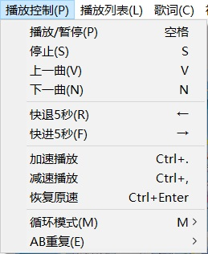

* 播放/暂停、停止、上一曲、下一曲、快进5秒、快退5秒

  这几个命令控制音乐播放。

* 加速播放、减速播放、恢复原速

  这几个命令可能调节播放速度。注意，调节速度后音乐的音调也会随之变化。

  播放速度改变后，主界面会显示当前的播放速度，如图所示：

  

* 循环模式

  可以在子菜单中选择一个循环模式。

  顺序播放：按顺序播放播放列表中的曲目，当播放完最后一首曲目后，跳到第一首曲目并停止播放。

  随机播放：随机播放列表中的曲目。支持回溯功能。点击“上一曲”按钮时会播放上一首播放的曲目，点击“下一曲”按钮时则随机播放一首曲目。

  列表循环：按顺序播放播放列表中的曲目，播放完最后一首曲目后，跳到第一首曲目继续播放。

  单曲循环：循环播放当前曲目。

* AB 重复

  AB 重复功能详细介绍参见<a href="# AB 重复功能">“AB 重复功能”</a>章节。

##### 播放列表

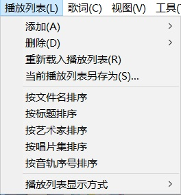

播放列表菜单下的菜单项与播放列表上方按钮菜单功能一致，详细说明参见<a href="# 播放列表菜单">“播放列表菜单”</a>部分。

##### 歌词

* 重新载入歌词

  此命令会重新搜索并载入当前歌曲的歌词。

* 复制当前歌词

  将当前一句歌词复制到剪贴板。

* 复制所有歌词

  将当前歌曲全部歌词复制到剪贴板（不包含时间标签）。

* 编辑歌词

  打开编辑歌词对话框以编辑当前歌曲的歌词。详细说明参见 “歌词功能”——“编辑歌词”章节。

* 繁简转换

  可以将当前歌词在繁体字和简体字之前转换。

  当歌词包含翻译时，此功能只会转换翻译文本而不会影响歌词原文，以避免将日文汉字转换成简体字的问题。

* 歌词提前0.5秒、歌词延后0.5秒

  如果歌词不同步，可以使用此命令可以调整歌词的进度。

* 保存歌词更改

  当调整了歌词进度或执行了繁简转换后此命令会变为可用，执行此命令以保存歌词更改。

  在“选项”——“歌词设置”——“歌词选项”中可以设置当歌词更改后自动保存。

* 删除歌词

  从磁盘删除关联的歌词文件（可以从回收站恢复）。

* 打开歌词文件位置

  在资源管理器中显示关联的歌词文件

* 下载歌词

  弹出下载歌词对话框，为当前歌曲匹配并下载歌词。

  详细说明参见“在线下载功能”——“歌词下载”章节。

* 歌词批量下载

  弹出歌词批量下载对话框，批量下载当前列表中所有曲目的歌词。

  详细说明参见“在线下载功能”——“歌词下载”章节。

##### 视图

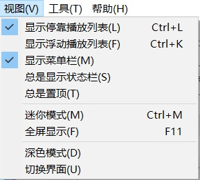

* 显示停靠的播放列表、显示浮动的播放列表

  可以设置播放列表是停靠在主窗口还是作为独立的窗口。

  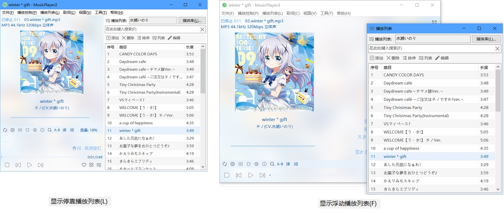

  选择“显示停靠的播放列表时”会自动隐藏浮动的播放列表。但是如果你愿意的话，你仍然可以同时显示停靠的播放列表和浮动的播放列表。

* 显示菜单栏

  去掉此菜单项的勾选可以隐藏菜单栏，隐藏菜单栏后，你可以通过右击标题栏打开主菜单，选择“视图”——“显示菜单栏”以重新显示菜单栏。

  此外，隐藏菜单栏，主窗口右上角会显示“主菜单”按钮，点击后也会弹出主菜单，如下图所示：

  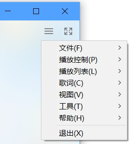
  
* 总是显示状态栏

  当播放正在加载当播放列表，或正在扫描媒体库时，主窗口最下方会出现状态栏显示状态信息，如下图所示：

  

  其他情况下，状态栏将隐藏。当勾选了“总是显示状态栏”时，状态栏将总是显示，并显示当前播放状态。

* 总是置顶

  勾选此项后，主窗口将具有置顶属性，它将总是置于其他窗口的上方。

* 迷你模式

  执行此命令后将进入迷你模式，详细说明参见“迷你模式”章节。

* 全屏显示

  执行此命令后将进入全屏显示模式，说明参见“主界面”——“全屏模式”章节。

* 深色模式

  执行此命令可以快捷切换深色模式和浅色模式。通过此命令切换深浅色模式时，浅色模式将自动设置为背景80%不透明度，而深色模式自动设置为背景50%不透明度。

* 切换界面

  此命令可以在两种界布局中来回切换。

##### 工具

* 媒体库

  此命令可以打开“媒体库”窗口。

  媒体库功能详细说明参见“媒体库”章节。

* 查找歌曲

  此命令打开“查找文件”对话框，功能同主界面工具栏中的“查找歌曲”按钮。

* 打开文件位置

  此命令会在资源管理器中显示正在播放的曲目。

* 曲目信息

  此命令会弹出属性对话框，并显示当前播放曲目的信息。功能同主界面工具栏中的“曲目信息”按钮。

* 音效设定

  此命令会弹出音效设定窗口，可以设置均衡器和混响。功能同主界面工具栏中的“音效设定”按钮。

* 转换格式

  执行此命令会弹出转换格式对话框，并将正在播放的曲目添加到转换格式列表中。如果要对指定曲目转换格式，可以在播放列表中选中要转换的曲目，再在播放列表右键菜单中选择“转换格式”命令。

  详细说明参见“格式转换功能”章节。

* 在线查看

  执行此命令会通过浏览器打开正在播放曲目关联的网易云音乐中歌曲的页面。

  在下载歌词或专辑封面时可以设置本地歌曲和网易云音乐歌曲的关联。如果执行此命令前还没有建立此关联，则程序会自动查找并匹配网易云音乐中的歌曲并建立关联。

* 重新初始化播放器

  执行此命令将会重新执行一次播放内核的初始化操作。此功能用于解决当添加或移除音频设备（例如插入或拨出耳机）时导致播放失败的问题。如果出现了此问题，执行一次此操作就能恢复正常了。

* 创建播放控制快捷方式

  执行此命令可以在程序所在目录下创建若干个播放控制快捷方式，你可以通过这几个快捷方式来控制音乐的播放，也可以将这几个快捷方式固定到任务栏。如图所示：

  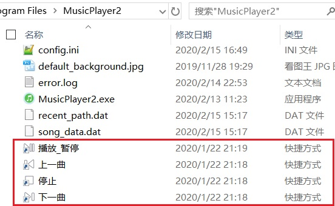

  固定到任务栏的效果：

  

  当播放器正在运行时，这些快捷方式可以控制音乐的播放。当播放不在运行时，执行任意一个快捷方式将会启动播放器。

* 专辑封面

  此菜单下有若干个子菜单：“下载专辑封面”、“专辑封面另存为”和“删除专辑封面”。

  下载专辑封面：弹出下载专辑封面对话框。专辑封面下载功能详细请参见“在线下载功能”——“下载专辑封面”章节。

  专辑封面另存为：将当前曲目的专辑封面作为图片文件保存到磁盘。

  删除专辑封面：将当前曲目关联的专辑封面图片从磁盘中删除（可从回收站恢复）。不支持删除内嵌的专辑封面。

  > 注意，如果当前播放曲目的专辑封面来自于内嵌专辑封面时，“下载专辑封面”和“删除专辑封面”命令不可用，因为播放器默认优先加载内嵌专辑封面，如果歌曲存在内嵌专辑封面，即使在线下载了专辑封面，播放器还是会将内嵌专辑封面作为显示的专辑封面。如果在“选项”——“外观设置”——“视觉效果”中取消勾选“优先使用内嵌专辑封面”，则程序将不再读取音频文件的内嵌专辑封面，总是加载外部图片作为专辑，此时这两个选项就是可用状态了。

* 播放时间统计

  此命令会弹出播放时间统计对话框，可以查看每一首曲目的总播放时间和播放次数，列表默认按播放次数降序排列。

  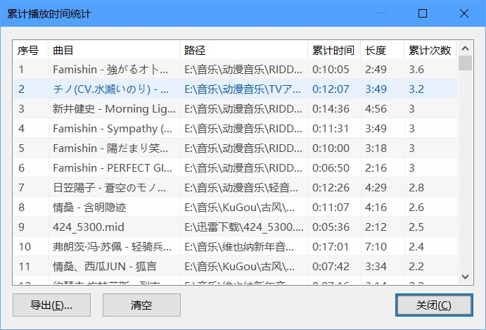

  点击“导出”按钮可以将此列表中的内容导出成 csv 格式的文本文件。

* 文件关联

  此命令将弹出“文件关联”对话框，以设置播放器对所有支持的文件格式的关联。

  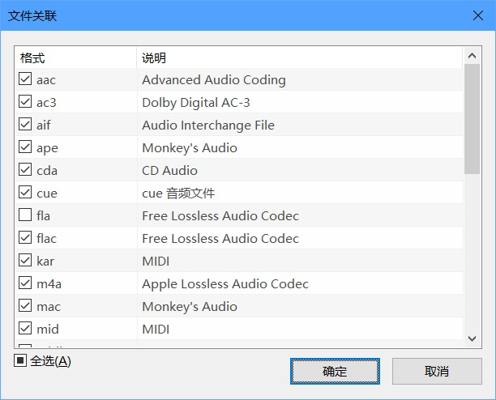

  > 注意，在此对话框中设置了文件关联后，通过资源管理器打开该格式的音频文件时可能仍然是系统默认的播放器，你可以在任意一个该格式的音频文件上点击鼠标右键，选择“属性”，在“打开方式”右侧点击”更改“按钮，此时会显示下图所示的界面：
  > 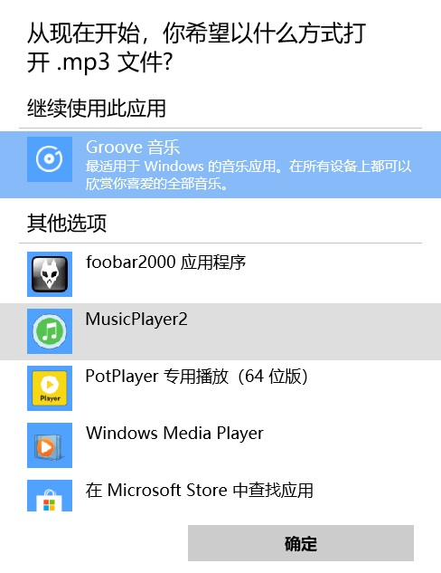
  > 在设置了文件关联后，此列表中会出现 MusicPlayer2 的选项，选择 MusicPlayer2 后，对应格式的文件就会默认以 MusicPlayer2 打开了。
  > 在设置了文件关联后，你还可以在”系统设置“——”应用“——”默认应用“中设置默认的音乐播放器。
  >
  > 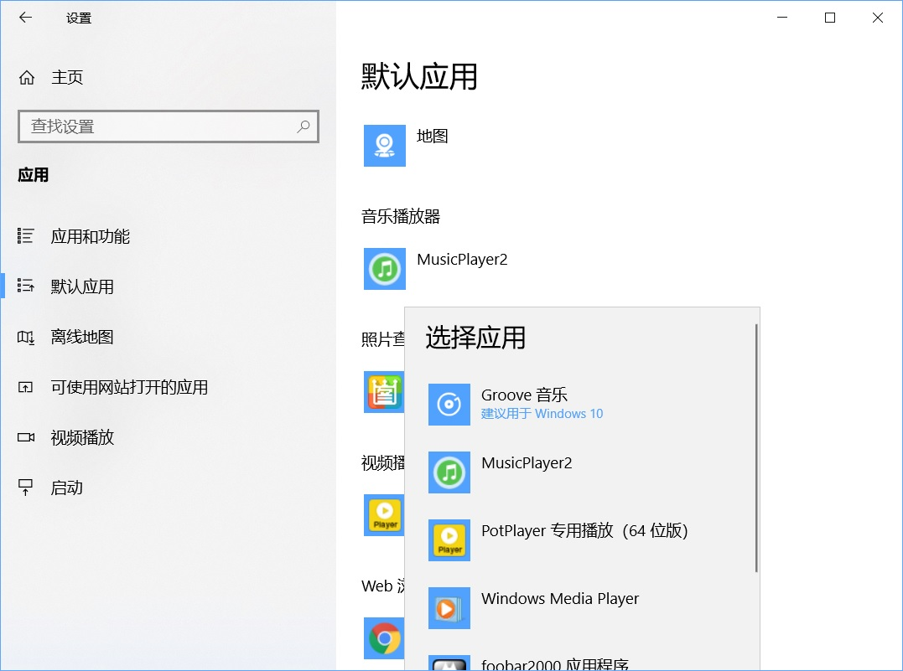

* 选项

  此命令将弹出选项设置对话框。

##### 帮助

* 帮助

  显示内置的帮助信息。

* 在线帮助

  转到 Github 页面并显示本文档。

* 支持的格式

  显示播放器支持的音频格式列表。此列表显示的内容会取决于加载的 BASS 插件，插件文件位于程序所在目录下的`./Plugins`目录下。更多插件可以到 http://www.un4seen.com/ 下载。下载后将dll文件放到`./Plugins`目录下，重新启动播放器即可。

* 关于

  打开“关于”对话框。

  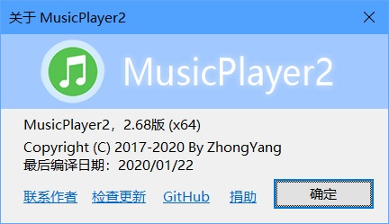

#### 播放列表菜单

播放列表上方有一排按钮，点击每个按钮会弹出相应的菜单。

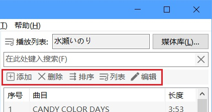

##### 添加

* 添加文件

  此命令可以向当前播放列表中添加一个或多个音频文件。此命令在文件夹模式下不可用，因为文件夹模式下当前播放列表是自动扫描文件夹下的音频文件得到的，如果文件夹下的音频文件有变动，可以点击“列表”——“重新载入播放列表”或选择右键菜单中的“重新载入播放列表”。

  关于文件夹模式和播放列表模式请参见“文件夹模式和播放列表模式”章节。

* 添加文件夹

  此命令可以向当前播放列表中添加一个文件夹中的音频文件。执行此命令后会打开“选择文件夹”对话框：

  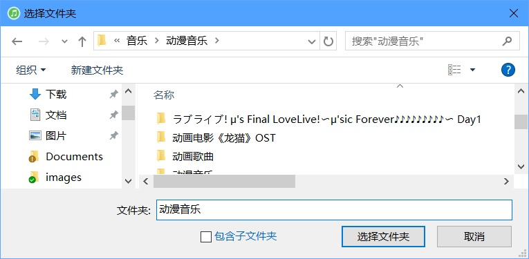

  勾选“包含子文件夹”可以同时添加选中文夹件中子文件夹的音频文件。

  此命令同样在文件夹模式下不可用。如果要更改正在播放的文件夹，可以执行主菜单中“文件”——“打开文件夹”命令，或者在“媒体库”窗口中“文件夹”标签页中选择播放过的文件夹，或者点击“打开新文件夹”按钮打开一个文件夹。

* 添加URL

  向当前播放列表添加一个音频文件的在线播放地址。

##### 删除

注：删除菜单下的菜单项中，除了“从磁盘删除”外，其他几个命令都是只有在播放列表模式下才可用，文件夹模式不可用，原因同上。

* 从列表中删除

  将选中项目从列表中移除。并不会删除磁盘文件。

* 从磁盘删除

  将选中项目从磁盘中删除。可以人回收站中恢复。

* 清空播放列表

  将播放列表中所有项目移除。

* 删除相同项

  如果播放列表中有相同的音频文件，则会将多余的移除只留下一个。

* 删除无效项

  将不存在的音频文件从列表中移除。

##### 排序

此菜单用于设置播放列表中项目的排序方式。在播放列表模式和文件夹模式中，此菜单的功能略有不同。

* 在文件夹模式下：

  在文件夹模式下，菜单项前面有单选标记，如图所示：

  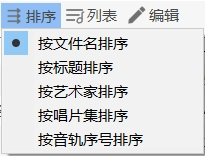

  你可以为每个文件夹设置不同的排序方式，每次只能设置一种排序方式。程序在读取并加载文件夹中的音频文件后，会根据设置的排序对列表排序。

* 在播放列表模式下：

  在播放列表模式下，菜单项前面设有单选标记，每个菜单项都是一个独立的命令，点击后将立即对当前播放列表执行一次排序。

##### 列表

* 重新载入播放列表

  文件夹模式下，重新读取文件夹下的音频文件并更新。播放列表模式下，重新读取播放列表文件中的数据并更新。同时此命令还会重新读取音频文件的标签信息。

* 当前播放列表另存为

  将当前播放列表另存为一个新的播放列表。

* 播放列表显示方式

  用于设置播放列表中曲目的显示方式。注意，如果曲目没有艺术家和歌曲标题，则只会显示为文件名。

##### 编辑

* 添加到播放列表

  可以将选中的曲目添加到指定的播放列表。子菜单中包含了你建立的播放列表，但是这个菜单中最多仅显示30个播放列表，如果你建立了超过30个播放列表，则菜单最后会出现“更多播放列表...”，选择此命令会弹出对话框以选择要添加到的播放列表。

* 复制文件到

  将选中的文件复制到指定文件夹。

* 移动文件到

  将选中的文件移动到指定的文件夹，并从播放列表中移除。

* 上移、下移

  将选中的一个或多个曲目上移/下移一个位置。此命令仅播放列表模式下可用。

### 选项设置

你歌词通过主菜单中的“工具”——“选项”，或者点击主界面工具栏中的“设置”按钮打开选项设置对话框。

此对话框会记住你上次关闭时选择的标签页。

#### 歌词设置

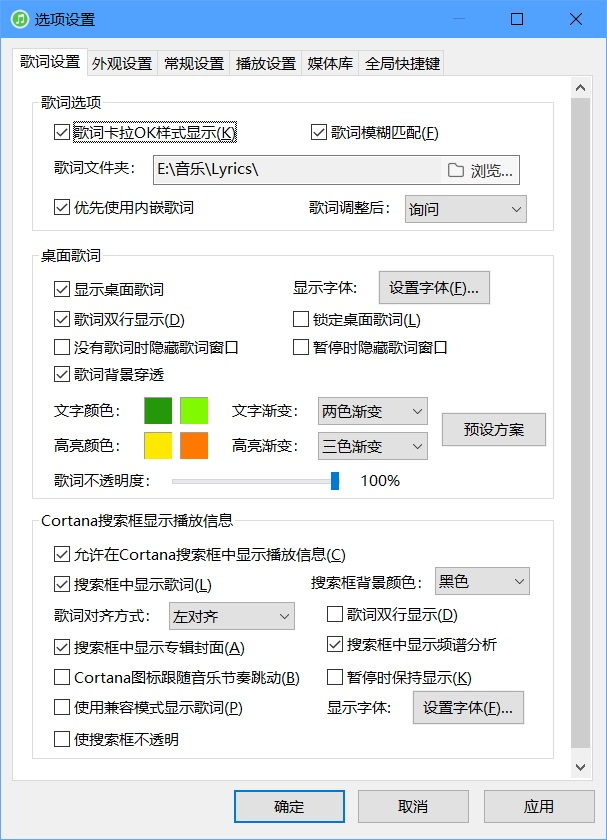

##### 歌词选项

* 歌词卡拉OK样式显示

  勾选后，正在播放的歌词中已播放的进度将会以另外一种颜色显示。

  此选项将影响主界面、任务栏搜索框和迷你模式中歌词的显示。

* 歌词模糊匹配

  勾选后，如果找不到和歌词文件名完全一样的歌词文件，则会查找文件名中包含歌曲的艺术家和歌曲标题的歌词文件。如果不勾选，则只会匹配文件名完全一样的歌词文件。

* 歌词文件

  设置存放歌词文件的文件夹。播放器在查找本地歌词时，会先在歌曲所在目录下查找，如果查找不到，就会在此文件夹下查找。

  > 注意：如果这里没有设置一个有效的文件夹目录，则下载歌词时将无法设置保存位置为“歌词文件夹”，同时，“选项”——“常规设置”——“下载设置”中也无法将自动下载的位置设置为“保存到歌词文件”。

* 优先使用内嵌歌词

  勾选此项时，播放器将优先读取音频文件内嵌的歌词。否则，将总是从文件加载歌词。

* 歌词调整后

  这里设置当调整了歌词进度或执行了繁简转换后是否保存的选项。

  设置为“不保存”，则歌词不会自动保存，你需要手动执行主菜单中“歌词”——“保存歌词更改”命令，或按下键盘快捷键 Ctrl+S。

  设置为“自动保存”，在播放下一首歌曲前会自动将对歌词的修改保存到文件。

  设置为“询问”，在播放下一首歌曲前会弹出对话框询问你是否保存对歌词作出的修改。

##### 桌面歌词

* 显示桌面歌词

  勾选后将显示桌面歌词。

  此选项的效果同主界面工具栏中“显示桌面歌词”按钮：。

* 显示字体

  点击“设置字体”后将弹出“字体”对话框以设置桌面歌词的字体、字形、大小，以及删除线、下划线的效果。

* 歌词双行显示

  桌面歌词会以双行的形式同时显示当前一句歌词和下一句歌词，对齐方式为两端对齐。

  此选项等同于桌面歌词工具栏中“歌词双行显示”按钮。

* 歌词双行显示、锁定桌面歌词、歌词背景穿透选项等同于桌面歌词工具栏上的对应按钮，详细说明参见“歌词功能”——“桌面歌词”章节。

* 文字颜色、文字渐变、高亮颜色、高亮渐变

  设置桌面歌词的颜色，文字颜色和高亮颜色最多支持两种颜色。

  渐变选项说明：

  无渐变：使用颜色1作为歌词的颜色。

  两色渐变：使用颜色1-颜色2的渐变。

  三色渐变：使用颜色1-颜色2-颜色1的渐变。

* 预设方案

  点击此按钮会弹出一个菜单，这里内置了三种桌面歌词的样式。

  选择“修改预设方案”，并在子菜单中选择一个方案，则会将当前颜色和渐变的设置覆盖到选择的预设方案。

  选择“修改预设方案”——“恢复默认”则会将三种预设的桌面歌词样式恢复到默认状态。

* 歌词不透明度

  修改桌面歌词的不透明度。

##### 搜索框显示播放信息

这里设置任务栏搜索框中显示的播放信息。

* 允许在Cortana搜索框中显示播放信息

  勾选后将启用搜索框显示播放信息功能，可以显示歌词、歌曲名称以及专辑封面。勾选后可能需要重新启动播放器才能生效。

* 搜索框中显示歌词

  勾选后，如果当前歌曲有歌词，则会在搜索框中显示歌词，否则，将总是显示正在播放的歌曲名称。

* 搜索框中显示专辑封面

  勾选后，原来显示Cortana图标的地方将会显示专辑封面。

* 搜索框中显示频谱分析

  勾选后将在背景处显示频谱分析。

* Cortana图标跟随音乐节奏跳动

  勾选后，左侧Cortana图标的大小将会随着音乐的节奏跳动。仅当不显示专辑封面时才有效。

* 暂停时保持显示

  在不勾选的情况下，音乐暂停时将不再刷新搜索框内容，当鼠标移动到搜索框上时，搜索框会恢复默认状态。勾选此项后，即使暂停时仍然会刷新搜索框内容。

* 显示字体

  点击“设置字体”将弹出字体对话框以设置字体、字形、字号及删除线、下划线效果。

* 使用兼容模式显示歌词

  勾选此项后，将不再通过在搜索框绘图的方式显示播放信息，而是直接将搜索框原来的文本（通常是“在这里输入你要搜索的内容”）修改为正在播放的歌词。如下图所示：

  

  勾选此项后，前面关于显示歌词、频谱分析、专辑封面等若干选项都会变成不可用状态。

  此选项用于当搜索框显示播放信息功能不正常时的替代方案。正常情况下建议**不要**勾选此项。

* 使搜索框不透明

  勾选此项后，可以使搜索框在播放器运行时变得不透明。此选项用于解决在Windows 10 1903 及更高版本中，如果使用白色任务栏主题，会导致搜索框信息无法显示的问题。如下图所示：

  

  勾选此选项时：

  

  勾选后需要重新启动播放器才能生效。如果搜索框显示播放信息功能功能正常，建议**不要**勾选此项。

#### 外观设置

点击菜单栏中的“工具”——“选项”——“外观设置”可以进行主界面相关设置。

##### 视觉效果

**频谱分析相关**

* “显示频谱分析”选项可以控制频谱分析是否显示。如下图所示。

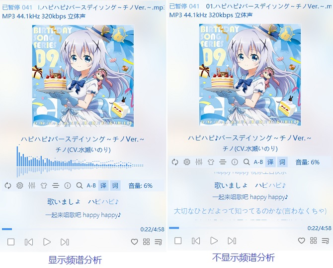

* “频谱分析高度”滑动条可以调节频谱显示的高度。

* “低频部分显示在中间”选项可以让频谱分析柱形中较高的部分显示在中间。如下图所示。

此选项会影响主界面和搜索框中的频谱分析显示。

**专辑封面相关**

* “没有专辑封面时使用外部图片”选项：

勾选此项时，如果即无法获取到当前歌曲的内嵌专辑封面，也无法找到该歌曲匹配的图片文件，则会在音频文件所在目录下查找“外部图片文件名”中设置的文件名作为专辑封面显示。例如，“外部图片文件名”中设置为“`cover,AlbumCover`”，当没有对应的专辑封面时，如果音频文件所在目录下有名为“`cover.*`”或“`AlbumCover.*`”的文件，则会将该文件作为专辑封面。

* “优先使用内嵌专辑封面”选项：

如果不勾选此项，则不会获取音频文件的内嵌专辑封面，而是从自动从网络下载匹配的专辑封面（如果在“选项”——“常规设置”——“下载设置”中勾选了“没有专辑封面时自动下载”的话）。

**界面背景相关**

* “启用背景”选项：

如果不勾选此选项，则主界面上不会显示背景图片，同时，界面中的工具栏和按钮将没有半透明样式。去掉此选项的勾选可以降低CPU的使用率，如果你的电脑性能太低，可以尝试去掉此选项的勾选。

此选项会同时影响主界面和迷你模式界面。

* “使用专辑封面作为背景”选项：

勾选此项时，会将当前专辑封面图片作为背景，并且可以为背景设置高斯模糊效果以及设置高斯模糊的程度。

如果不勾选此项，则会使用程序所在目录下的“`default_background.jpg`”文件作为背景，此时不可以设置背景高斯模糊。你可以自由将此文件更换为你喜欢的图片。

* “背景高斯模糊”选项：

此选项可以实现背景高斯模糊的效果，并设置高斯模糊的程度。

* “歌词界面背景”选项：

勾选此选项会在主界面的歌词下面添加一个半透明的矩形背景，以避免背景图片导致歌词看不清。

* 深色模式：

此选项可以在浅色模式和深色模式下切换。如下图所示。

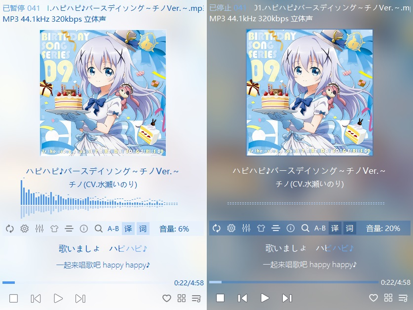

另外，通过主菜单“视图”——“深色模式”命令可以快捷切换深色模式和浅色模式。

##### 歌词显示

* 字体

  点击“设置字体”后以设置歌词字体。

* 歌词行间距

  这里设置歌词多行显示时的行间距。

* 歌词对齐方式

  设置主界面歌词的对齐方式。影响歌词单行显示和多行显示时的样式，但是不影响双行显示的样式，双行显示时总是左右两端对齐。

##### 主题颜色

在这里可以设置播放器的主题颜色。

勾选“跟随系统主题颜色”后，播放器会将当前Windows系统主题颜色作为当前播放器主题颜色。

主题颜色功能详细请参见“主界面”——“主题颜色”章节。

#### 常规设置

##### 应用程序设置

* 启动时检查更新

  勾选后，播放器在启动时会在后台执行一次检查更新，如果发现了新版本，会弹出消息提示框，点击“确定”后将会直接下载新版本。

  如果你需要手动检查更新，可以选择主菜单中的“帮助”——“关于”，点击“检查更新”链接。

* 语言

  设置播放器的界面语言。默认设置为“跟随系统”，此时会根据你的Windows系统的语言自动选择对应的语言版本。

  目前仅提供中文和英文两种语言。

##### 下载设置

这里设置播放器在打开歌曲时自动下载歌词和专辑封面的功能

* 没有专辑封面时自动下载

  如果播放歌曲时，音频文件没有内嵌专辑封面，也没有找到本地专辑封面图片，则会自动在后台下载对应的专辑封面。

  暂时只支持下载到音频文件所在目录。

  如果本地音频文件的“唱片集”信息和在线搜索匹配的歌曲一致，则将下载的专辑封面文件的文件命名为唱片集名，否则，将命名为与音频文件同名。

* 没有歌词时自动下载

  如果播放歌曲时，没有找到对应的歌词，则自动在后台下载对应的歌词。

* 歌词保存位置

  可以设置自动下载时歌词文件的保存位置。

  默认为保存到歌曲所在目录。如果设置为保存到歌词文件夹，则当将下载的歌词保存到“歌词设置”——“歌词选项”——“歌词文件”中设置的目录。如果歌词文件设置得不正确，则“保存到歌词文件夹”选项不可用。

* 只有歌曲信息完整时才自动下载

  勾选此项时，只有当歌曲的“标题”和“艺术家”都不为空时，才会在打开时自动下载歌词和专辑封面。

> 注：为了避免没有歌词的曲目每次播放时都向网易云音乐请求下载歌词/专辑封面，程序会在首次自动下载歌词/专辑封面失败后将此歌曲标记为没有歌词/专辑封面，下次播放时不再执行自动下载。你仍然可以手动下载歌词和专辑封面。

##### MIDI 设置

* MIDI 音色库路径

  必须要有MIDI音色库 (*.sf2) 文件才能播放MIDI音乐，否则，播放MIDI音乐时将听不到任何声音。你可以在这里设置一个MIDI音色库文件的路径。另外，你也可以将音色库文件放到“`./Plugins/soundfont`”目录下，播放器会自动加载此音色库。

  更改此项后需要重新启动播放器才能生效。

* 优先显示 MIDI 音乐内嵌的歌词

  有些 MIDI 音乐包含了歌词，勾选此项后将默认显示MIDI音乐内嵌的歌词。但是MIDI音乐内嵌歌词显示效果和普通的歌词不太一样，它一次只能显示当前一句的歌词，而且无法看到未播放的歌词，如下图所示：

  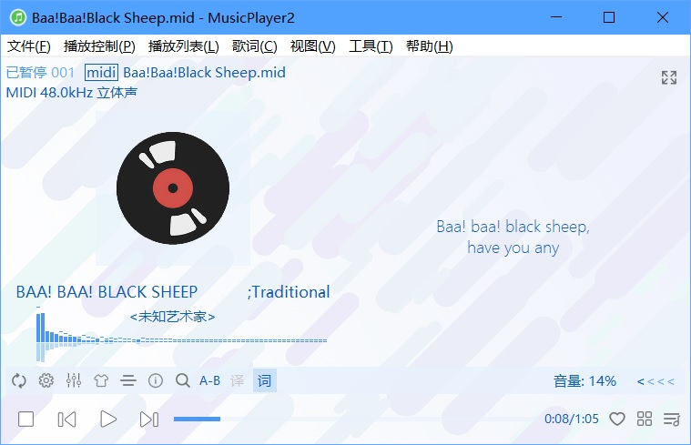

##### 关闭主窗口

这里设置当关闭主窗口执行的操作。

如果选择“最小化到通知区”，则关闭主窗口后不会退出程序，点击通知区的图标会再次显示主窗口。

如果选择“退出程序”，则关闭主窗口后程序将直接退出。

##### 其他设置

* 优先获取ID3V2标签

  勾选此项后，程序在获取MP3标签信息时会优先读取ID3V2标签，如果没有，再读取ID3V1标签。否则，将优先读取ID3V1标签。

#### 播放设置

##### 播放选项

* 出现错误时停止播放

  当列表中一首歌曲播放出错时，就不再连续播放。

* 程序启动时自动播放

  勾选后，当程序启动时，将自动播放上次播放的曲目。否则，程序启动时处理播放停止状态。

* 在任务栏显示播放进度

  勾选后，会在任务栏显示当前曲目的播放进度，如下图绿色部分所示：

  

  此功能仅 Windows7 及以上操作系统支持。

* 在任务栏显示播放状态图标

  勾选后，会在任务栏播放器图标右下角显示一个小图标以指示当前播放状态，如上图中三角形图标所示。

  此功能仅 Windows7 及以上操作系统支持，且必须将任务栏图标设置为大图标。

* 声音淡入淡出效果

  勾选此项后，在播放和暂停时，声音会有一个短暂的淡入淡出效果。

##### 播放内核

这里提供了两种播放内核切换。暂时支持BASS和MCI两种内核。

* BASS

  本播放器默认的播放内核，功能强大且播放效果较好。通常情况下建议使用此内核。

* MCI (Media Control Interface)

  系统自带的播放内核，且已经多年不再维护，并存在一些BUG。使用此内核时，部分功能诸如音效设定、格式转换等将不可用。此内核可以支持的格式较少，部分MP3文件还会无法播放。如果没有特别的需求，建议**不要**使用此内核。此内核的一个好处是不需要第三方音色库文件 (*.sf2) 就可以播放 MIDI 音乐，如果你想通过 MusicPlayer2 播放 MIDI 音乐但是又找不到音色库文件，可以尝试切换到此内核。

#### 媒体库

可以通过媒体库对话框中“媒体库设置”按钮进入媒体库设置，你也可以通过主菜单中的“工具”——“选项”——“媒体库”进入。

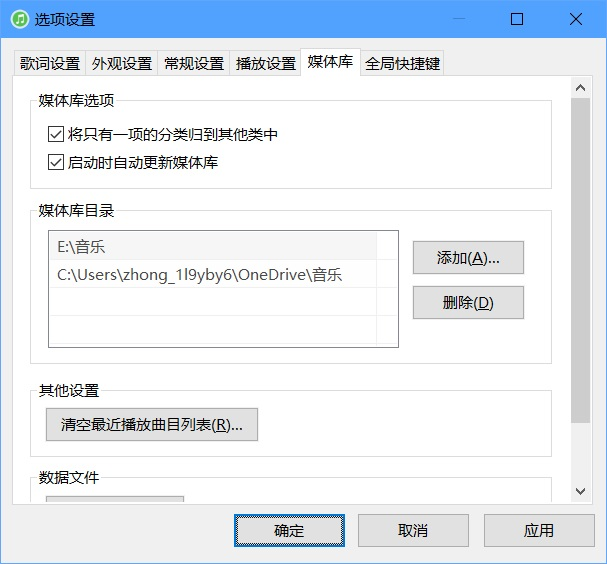

##### 媒体库选项

* 将只有一项的分类归到其他类中

此选项用于避免媒体库中“艺术家”、“唱片集”和“流派”标签中左侧列表中的项目过多。勾选此项时，以艺术家标签为例，如果某个艺术家下只有一首曲目，则左侧列表不再单独出现该艺术家，而是将该曲目归到“`<其他>`”类中。即左侧列表中不会出现只有一首曲目的艺术家。不勾选此项时，则不会出现“`<其他>`”类。

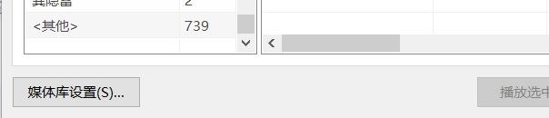

此选项不适用于“年份”标签。

* 启动时自动更新媒体库

勾选此选项时，程序启动时会在后台自动扫描“媒体库目录”中设置的目录下的音频文件，并将其添加到媒体库。

##### 媒体库目录

这里设置媒体库文件夹，程序在自动扫描媒体库文件时会扫描这里设置的文件夹。默认情况下会有一项系统默认的“音乐”文件夹。你可以点击“添加”按钮添加新的文件夹。

##### 其他设置

* 清空最近播放曲目列表

  点击此按钮可以清空媒体库对话框中“最近播放”标签中列表里的项目。

##### 数据文件

程序所在目录下包含一个“`song_data.dat`”文件，此文件为整个媒体库数据的本地缓存。点击“清理数据文件”按钮将会清理媒体库中不存在的文件，并更新到数据文件。

如果勾选了“启动时自动更新媒体库”，则程序在启动时更新媒体库时会自动清理一次媒体库。

#### 全局快捷键

这里可以设置即使播放器在后台运行也能响应的快捷键。

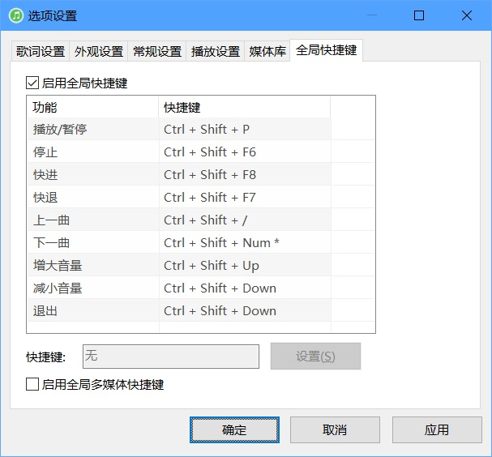

* 启用全局快捷键

  勾选此项后将启用全局快捷键功能。

设置全局快捷键的方法如下：

1. 选中列表中的一行。例如下图中选中了“上一曲”：

   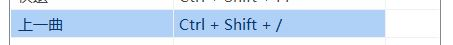

2. 将光标定位到“快捷键”右边的搜索框，然后按下要设置的快捷键，文本框中会显示你刚刚按下的快捷键。例如下图中按下了 Ctrl + Shift + C 。

   

3. 点击“设置”按钮，就完成了更改快捷键。例如本例中将“上一曲”的快捷键更改成了 Ctrl + Shift + C 。

* 启用全局多媒体快捷键

  勾选此项后，即使程序在后台运行，你也可以使用键盘上的多媒体按键控制音乐的播放。需要重新启动播放器才能生效。

### 歌词功能

#### 主界面歌词

如果正在播放的歌曲有歌词，则会在主界面歌词区域显示歌词，否则会显示“当前歌词没有歌词”。

歌词显示分为单行显示、双行显示和多行显示三种模式。程序会根据歌词区域的高度自动调整为这有三种模式中的一种。

* 单行显示：

如果歌词区域高度小于一定值，则会使用单行显示模式。此时，即使有歌词翻译，也只会显示原文而不显示翻译。

* 双行显示

当歌词区域高度变大时，会使用双行显示模式。此时，会根据是否显示歌词翻译而显示不同的样式。

显示歌词翻译时，歌词原文在上，翻译在下，对齐方式跟随“选项”——“外观设置”——“歌词显示”中对齐方式的设置。如下图所示：

不显示歌词翻译（或设有歌词翻译）时，歌词采用当前歌词和下一句歌词左右对齐的方式显示，此时不跟随选项设置中歌词对齐方式的设置，如下图所示：

* 多行显示

当歌词区域高度超过一定的值时，会使用多行显示模式，如下图所示：

#### 桌面歌词

点击主界面工具栏中的“显示桌面歌词”按钮，或者在“选项”——“歌词设置”——“桌面歌词”中勾选“显示桌面歌词”，即可显示桌面歌词。

当鼠标指针移动当桌面歌词窗口区域时，桌面歌词工具栏会显示出来。

**工具栏按钮说明**：

* 主菜单按钮

  点击此按钮弹出主菜单。

* 播放控制按钮

  停止、上一曲、播放/暂停、下一曲。

* 设置按钮

  点击进入歌词设置。点击此按钮后总是会进入“歌词设置”标签。

* 预设方案按钮

  点击此按钮会弹出一个菜单，以快速应用预设方案。你可以在“选项”——“歌词设置”——“桌面歌词”中修改每个预设方案的样式。

* 歌词调整按钮

  这两个按钮用于调整歌词进度，功能等同于主菜单中“歌词”下面的“歌词提前0.5秒”和“歌词延后0.5秒”。

* 歌词双行显示按钮

  此按钮用于开启或关闭歌词双行显示。

* 歌词背景穿透按钮

  此按钮用于开启或关闭歌词背景穿透功能。

  关闭此功能时，当鼠标指针移动到桌面歌词区域时，会显示一个半透明的背景。此时当鼠标移动到窗口边缘时可以调整桌面歌词窗口的大小。在桌面歌词窗口任意位置点击鼠标右键都可以弹出右键菜单。

  开启此功能时，不会显示半透明的背景，鼠标指针在透明区域会穿透歌词窗口，此时无法调整窗口大小。

* 锁定桌面歌词按钮

  点击此按钮后，将锁定桌面歌词。此时，整个桌面歌词窗口都处于鼠标穿透状态，除了歌词上方的“解锁桌面歌词按钮”。

  桌面歌词处于锁定状态时，工具栏只剩下一个“解锁桌面歌词”按钮，点击此按钮将解锁桌面歌词。如下图所示：

  

  你还可以通过通知区图标右键菜单中“锁定桌面歌词”命令来解锁桌面歌词。

* 关闭桌面按钮

  点击此按钮将关闭桌面歌词。你可以通过主界面工具栏中的“显示桌面歌词”按钮重新打开桌面工具栏。

#### Windows10搜索框显示播放信息

MusicPlayer2 支持在 Windows10搜索框中显示歌曲名、歌词、专辑封面、频谱分析等信息。

默认情况下此功能未开启，需要在“选项”——“歌词设置”——“Cortana搜索框显示播放信息”中开启“在Cortana搜索框中显示播放信息”，可能需要重新启动程序才能生效。

关于此功能的详细设置请参见“选项设置”——“歌词设置”——“搜索框显示播放信息”章节。

#### 编辑歌词

在主菜单中选择“歌词”——“编辑歌词”，或在主界面歌词区域点击鼠标右键，选择“编辑歌词”命令，可以弹出“编辑歌词”对话框，以编辑当前歌词。如下图所示：

##### 命令说明

* 插入时间标签（快捷键：F8）

  在光标所在行插入一个当前播放时间的时间标签。

* 替换时间标签（快捷键：F9）

  将光标处的时间标签替换成当前播放时间的时间标签。

* 删除时间标签（快捷键：Ctrl + Delete）

  删除光标所在行的时间标签。
  
* 保存（快捷键：Ctrl + S）

  保存歌词更改。

  如果当前歌词是新建的歌词（歌词路径右侧的文本框为空），点击“保存”后将自动保存到歌曲所在目录，文件名与歌曲文件名相同。如果要保存到其他目录，可以执行菜单栏中“文件”——“另存为”命令。

* 播放/暂停、快进、快退

  用于在编辑歌词时快捷控制音乐的播放。

* 查找、替换

  弹出查找/替换对话框。暂时不支持不区分大小写和全词匹配。
### AB 重复功能

AB重复功能可以为用户学习外语时提供便利。

点击主界面工具栏上的AB重复按钮，以及使用此按钮的右键菜单或主菜单“播放控制”——“AB重复”中的命令，可以使用AB重复功能。

**命令说明：**

* 设置A点

  执行此命令后，会将当前播放位置设置为AB重复的A点。此时，进度条上会出现A点的标记，如下图所示：

  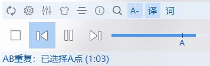

  如果在主菜单中的“视图”下勾选了“总是显示状态栏”，则状态栏会显示已设置A点的时间。

  另外当鼠标移动到AB重复按钮上时也会显示同样的提示信息

* 设置B点

  执行此命令后会将当前播放位置设置为AB重复的B点，并进入AB重复状态。同时，进度条上会出现B点的标记，如下图所示：

  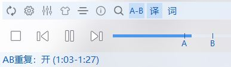

  此时状态栏会显示当前AB重复的时间范围。

  在AB重复状态下，你无法将进度条设置到A-B区间外，任何定位到区间外的操作都会被强制定位到A点，除非取消AB重复状态。

  注意，B点的位置必须至少超过A点100毫秒，如果在不正确的位置设置了B点，则会取消AB重复模式。

* 继续下一句AB重复

  此功能仅在AB重复状态下才有效。在AB重复状态下执行此命令后，会将当前AB重复区间的B点设置为A点，并进入“已选择A点”的状态。此时执行“设置B点”命令可以再次进入AB重复状态。

  此功能适用于在学习外语时快捷进入下一句的AB重复功能。

工具栏上的AB重复按钮，以及菜单中的“AB重复”命令（快捷键：Ctrl + R），可以快捷使用AB重复功能。执行此命令会在“正常模式”——“已选择A点”——“AB重复”三个状态下循环切换。

### 迷你模式

点击主界面工具栏中的“迷你模式”按钮，或执行主菜单中“视图”——“迷你模式”命令可以进入迷你模式。如下图所示：

迷你模式界面样式跟随主界面样式，可以在“选项”——“外观设置”——“视觉效果”中设置。

迷你模式窗口总是具有置顶属性，它总是处于其他窗口的上方。

点击“显示/隐藏播放列表”按钮可以显示播放列表，如下图所示：

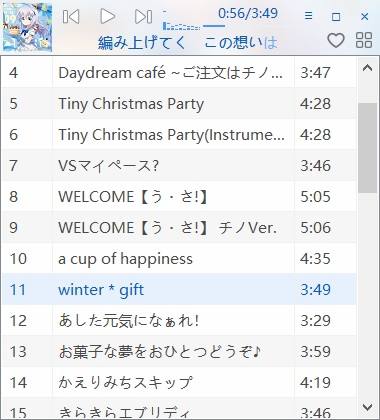

播放列表功能同主界面播放列表一致。

### 歌曲查找功能

点击主界面工具栏中的“查找歌曲”按钮，或执行主菜单——“工具”——“查找歌曲”命令可以弹出歌曲查找对话框，如下图所示：

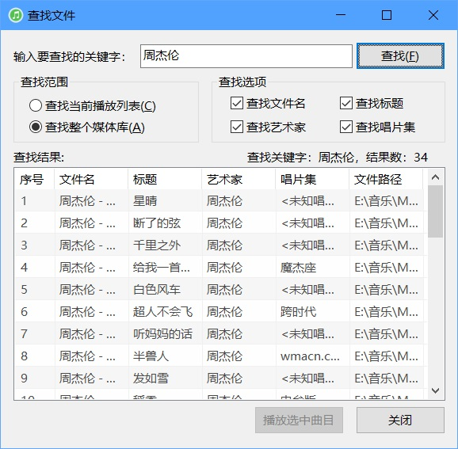

在文本框中输入要查找的关键字，点击“查找”按钮即可。

#### 选项说明

**查找范围**

查找当前播放播放列表：仅查找正在播放的播放列表中的曲目。

查找整个媒体库：查找整个媒体库中的曲目，包含程序自动扫描并添加到媒体库中的曲目和所有播放过的曲目。

**查找选项**

可以设置查找的关键字的范围。

#### 查找结果

点击“查找”后，如果有可以显示的结果，则会在列表中显示。选中列表中的项目后点击“播放选中曲目”，或在右键菜单中选择“播放”，会将选中曲目添加到“默认”播放列表中播放。

如果在右键菜单中选择“在文件夹模式中播放”，则会在文件夹模式中打开选中文件所在的文件，并播放选中曲目。

此对话框框支持记住上次查找的结果。即关闭此对话框后，下次再打开还会显示上次的查找结果。

#### 快速查找功能

在播放列表上方，以及媒体库每个标签页中，都有一个搜索框，如下图所示：

直接在此搜索框输入关键字，列表中会快速筛选出包含关键字的项目。在快速查找时会筛选出文件名、歌曲标题、艺术家和唱片集中包含输入的关键字的项目。

### 在线下载功能

#### 下载歌词

#### 下载专辑封面

### 格式转换功能

MusicPlayer2 支持将任意可以播放的音频格式转换成 wav、mp3、wma 和 ogg 格式。

要使用格式转换功能，可以在播放列表中选中一个或多个项目，然后在右键菜单中选择“转换格式”命令，即可打开转换格式对话框，如下图所示：

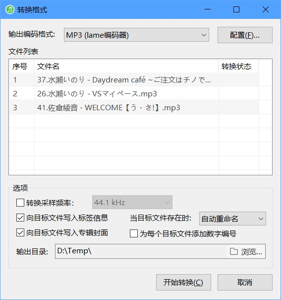

你可以在文件列表中点击鼠标右键，可以通过右键菜单添加或删除文件，还可以调整项目的顺序。

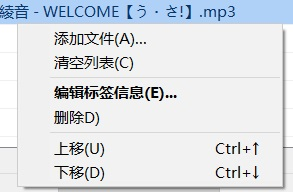

##### 编辑标签信息

此功能可以在转换格式前编辑要写入目标文件的标签信息，需要在“格式转换”对话框下方的“选项”中勾选“向目标文件写入标签信息”。

在文件列表右键菜单中选择“编辑标签信息”命令，或双击列表中的一项，会弹出对话框以编辑文件的标签信息。如下图所示：

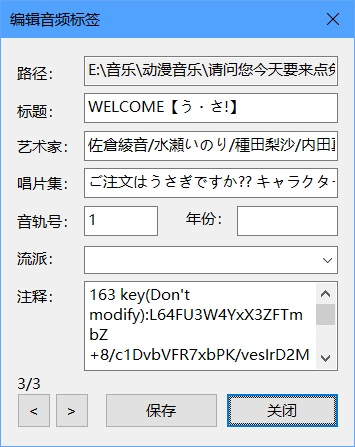

这里编辑的音频标签信息并不会影响原始文件（事实上，MusicPlayer2 目前还不支持除ID3V1以外的标签写入功能），而是会被写入到转换后的目标文件中。

要注意的是，如果关闭了“转换格式”对话框却还没有执行格式转换，则所有编辑过的音频标签信息都会丢失。

##### 选择输出编码格式

在“输出编辑格式”下拉列表中可以选择输出文件的编码格式。点击“配置”按钮可以配置所选输出格式的编码参数。

选择 wav 格式为输出格式，没有配置选项，“配置”按钮不可用。

* MP3 编码选项

  输出为 mp3 格式使用了 lame 编码器，文件位于“`".\Encoder\lame.exe"`”。

  选择输出格式为 mp3 格式时，点击“配置”按钮会弹出 MP3 编码选项对话框，如下图所示：

  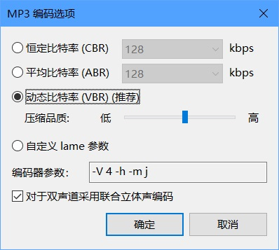

  在这里可以设置输出文件的比特率，有“恒定比特率”、“平均比特率”和“动态比特率”可选。其中“动态比特率”与恒定比特率相比能在更小的文件体积下提供更好的音质，但是某些过旧的播放软件或设备可能不支持动态比特率，而恒定比特率则兼容性较好。

  “自定义 lame 参数”适用于高级用户。

  其中 lame 参数的含义可以通过以下方法查询：

  在命令行或 Windows PowerShell 下进入`.\Encoder`目录，输入命令`.\lame.exe --longhelp`即可查看所有可用命令的详细说明，如下图所示：

  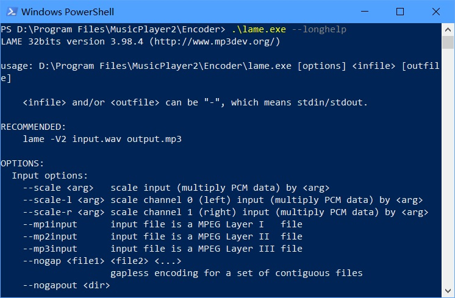

* WMA 编码选项、OGG 编码选项

  选择输出格式为 wma/ogg 格式时，点击“配置”按钮会弹出 WMA 编码选项/OGG 编码选项对话框，如下图所示：

  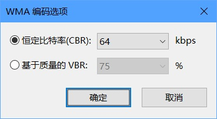

  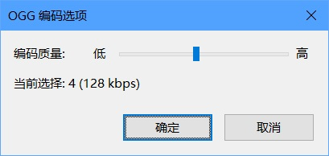

  在这里可以配置输出 wma/ogg 格式的比特率。

##### 转换格式选项

在“转换格式”对话框中可以设置转换格式的选项。

* 转换采样频率

  用于设置是否转换采样频率，勾选后可以设置采样频率。

* 向目标文件写入标签信息

  勾选后，会将源文件中的标签信息信息复制到目标文件。另外，在转换前你还可以在文件列表右键菜单中选择“编辑标签信息”来编辑这此标签信息。

* 向目标文件写入专辑封面

  此选项目前仅对输入为 mp3 格式有效。另外由于编码器的限制，只能写入文件大小不超过128KB的专辑封面。

* 当目标文件存在时

  此选项可以设置存在同名目标文件时的操作。

  自动重命名：自动在文件名后面添加“ (1)”，如果文件名末尾已经存在带括号的数字，则将数字加1。

  忽略：直接跳过该文件的转换。

  覆盖：覆盖目标文件。

* 为每个目标文件添加数字编号

  转换后会在每个目标文件前添加一个数字编号，编号为转换列表中的序号。

* 输出目录

  设置转换格式后目标文件的输出目录。

设置完毕后点击“开始转换”按钮就可以执行格式转换操作了。格式转换过程中，不允许再编辑选项及配置编码格式，界面所有控件处于不可用状态。

##### 错误说明

有时个格式转换会出现错误，在文件列表的“转换状态”一列会显示出错，如下图所示：

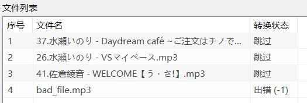

括号中的数字代码不同的错误类型。

* -1：源文件无法读取。源文件无法作为音频文件被 bass 解析。
* -2：编码通道创建失败。有可能是目标文件的比特率不支持选择的采样频率。
* -3：找不到编码器或编码器参数错误。
* -4：没有MIDI音色库。

### MIDI播放功能

MusicPlyer2 支持播放 MIDI 音乐。如果要使用 MIDI 播放功能，需要在“设置”——“常规设置”——“MIDI 设置”中设置 MIDI 音乐库文件 (*.sf2) 的路径。

播放 MIDI 音乐时，主界面文件名左侧会显示“`midi`”的标识。同时，原来显示艺术家和唱片集的地方显示了节拍和音色库。如下图所示：

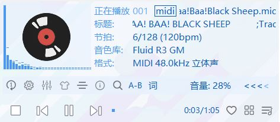

同时，工具栏最右侧的“<<<<”会根据 MIDI 音乐的节拍滚动。

### 播放 osu 游戏安装目录中的歌曲

播放器支持直接播放 osu 中已下载的歌曲。选择“文件”菜单中的“打开文件夹”，然后选择 osu 安装目录下的 Songs 文件夹打开即可。播放器会从对应的 osu 文件中获取曲目标题、艺术家以及背景图片。你可以设置一张默认的图片作为未找到对应背景图片时加载的图片，具体方法如下：打开程序所在目录下的 config.ini 文件，在[other]下面添加 “default_osu_img”项，将其设置为默认背景图片的路径。例如 default_osu_img = "D:\Pictures\image.jpg"。

在播放 osu 中的歌曲时，主界面文件名左侧会显示“`osu`”标识，如下图所示：

## 已知问题

### 任务栏缩略图和播放按钮的问题