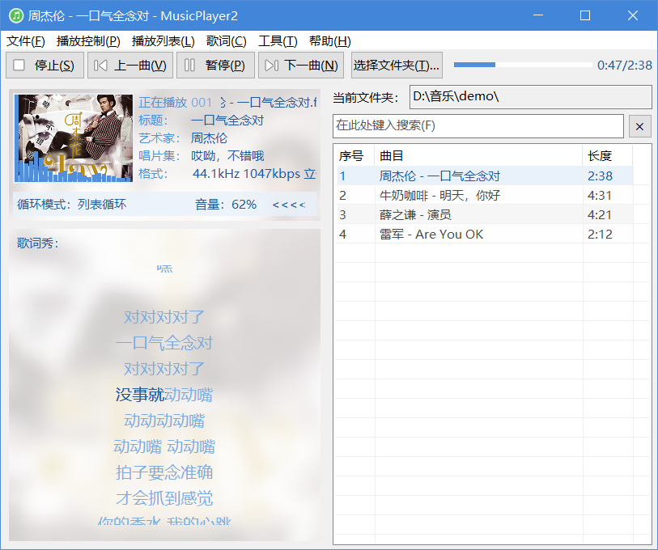
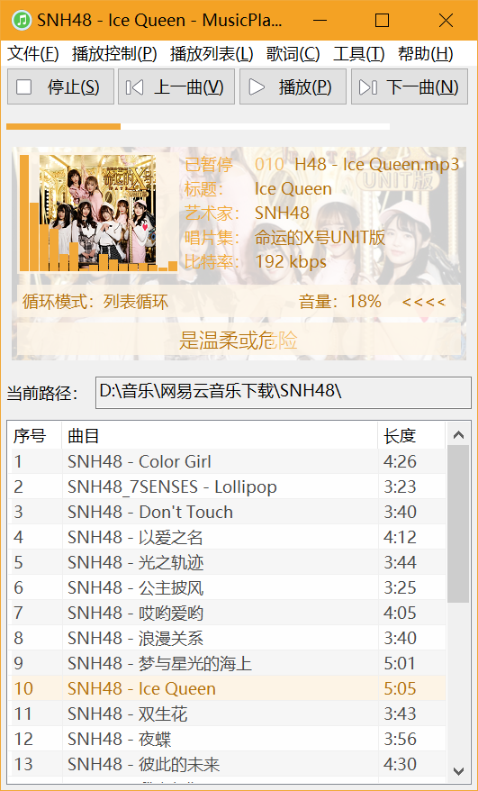
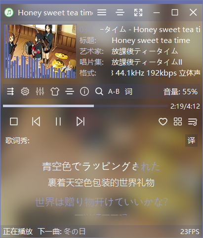
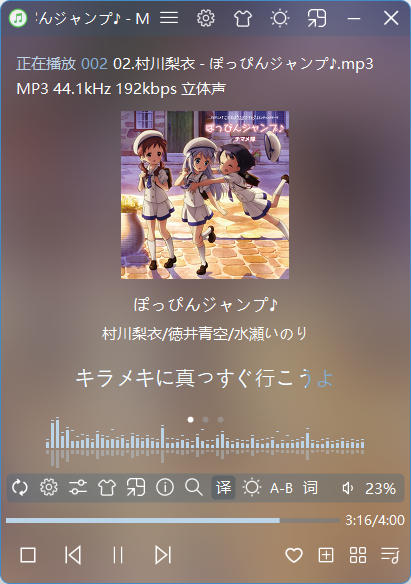
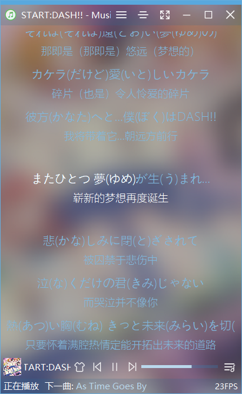
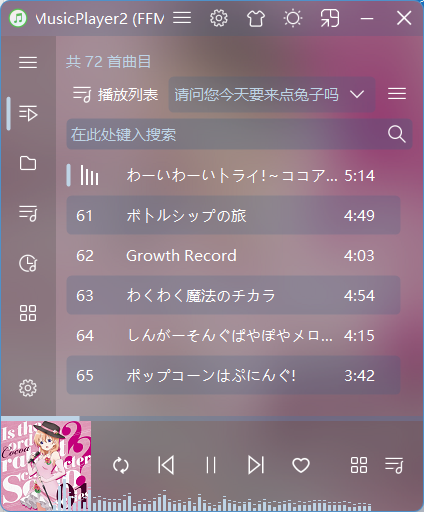
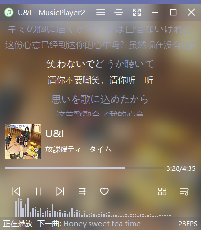
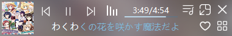
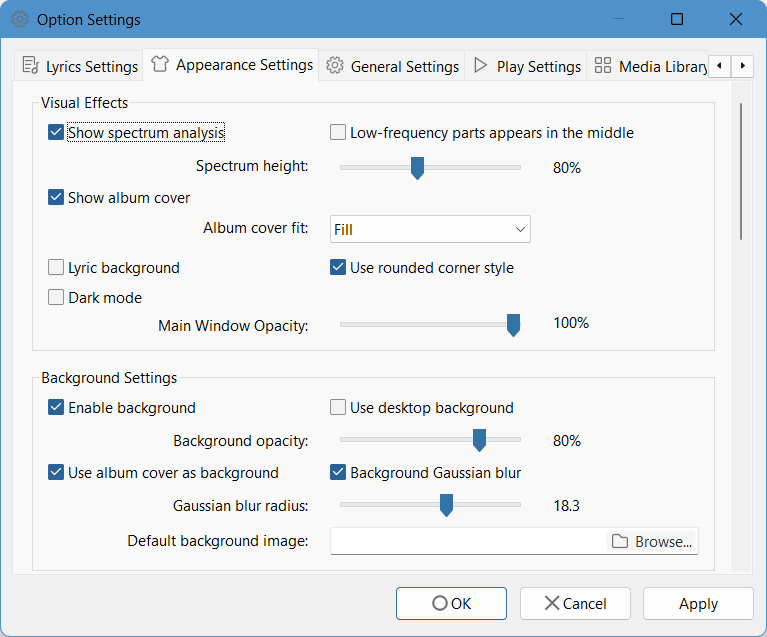
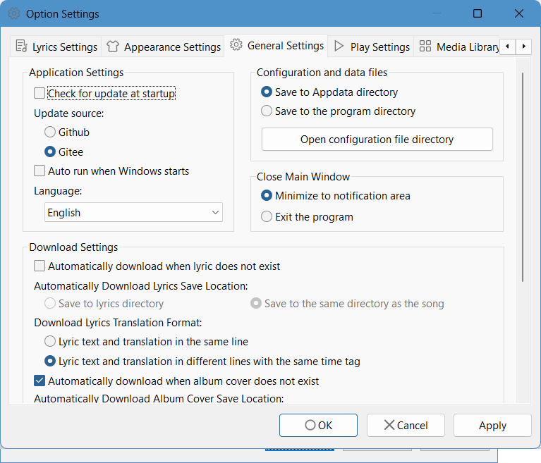

**[简体中文](https://github.com/zhongyang219/MusicPlayer2/blob/master/README.md) | English** 
# MusicPlayer2 Introduction
MusicPlayer2 is an audio player which with a collection of music playback, lyrics display, format conversion and many other functions. It supports lyrics display, lyrics karaoke style display, lyrics online download, lyrics editing, song tag recognition, album cover display, album cover online download, spectrum analysis, sound effect settings, taskbar thumbnail button, theme color, format conversion and other functions. The playback kernel is the Bass Audio Library (V2.4). The player supports almost all common audio formats. 
# Related Links
Please [click here](https://github.com/zhongyang219/MusicPlayer2/releases)to download the latest version of MusicPlayer2.

Alternate link: Download from [Baidu Netdisk](https://pan.baidu.com/s/1i5QNwFF)

# Main Features
* Lyrics display
* Mini mode
* Lyrics karaoke style display
* Show lyrics in the taskbar search box
* Desktop lyrics display
* Lyrics online download
* lyrics editing
* Song tag recognition and editing
* Spectrum analysis
* Album cover display
* Auto match download lyrics and album cover
* Sound effect settings (equalizer and reverb)
* Taskbar thumbnail button
* Theme color
* Support for cue format
* Background Gaussian Blur
* Format conversion
* Media library function
# Operating Instructions
You have the following ways to open and play a song: 
1. Select the "Open File" item on the File menu; 
2. Select the "Open folder" item on the File menu; 
3. Click the "Select Folder" button or select the "Select Folder" item on the "Tools" menu, select a recently played folder in the popped up dialog, or click the "Open new folder" button to play a new folder; 
4. Drag and drop the file or folder directly into the main window of the program; 
5. Drag and drop the file or folder directly onto the program's icon or its shortcut icon. 

# Instructions for use

**[Click here](https://github.com/zhongyang219/MusicPlayer2/wiki) to view the documentation (Only Chinese Available).**

# Screen shoots

Main window (UI2, light mode)▼

Main window (UI2, light mode, show playlist)▼

Main window (UI2, dark mode)▼

Main window (UI1)▼

Main window (UI2)▼

Main window (UI3)▼

Main window (UI4)▼

Main window (UI5)▼

Mini mode▼

Show lyrics in Cortana search box▼

Desktop lyrics▼

Option settings - Appearance Settings▼

Option settings - General Settings▼

# Update log
**[Click here to view the update log.](https://github.com/zhongyang219/MusicPlayer2/blob/master/Documents/update_log_en-us.md)**